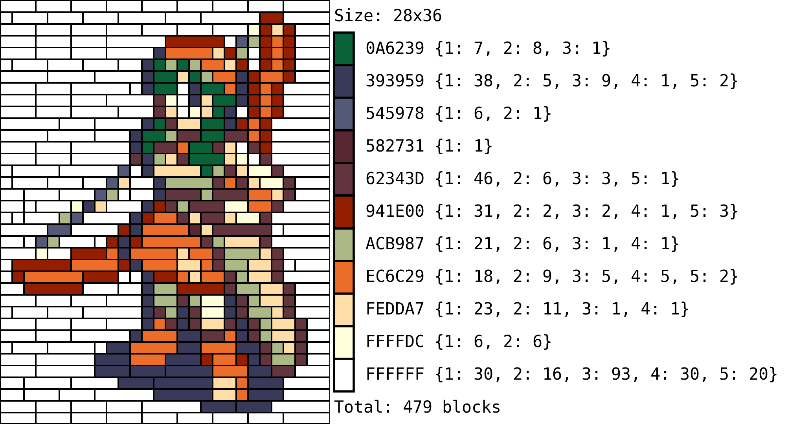
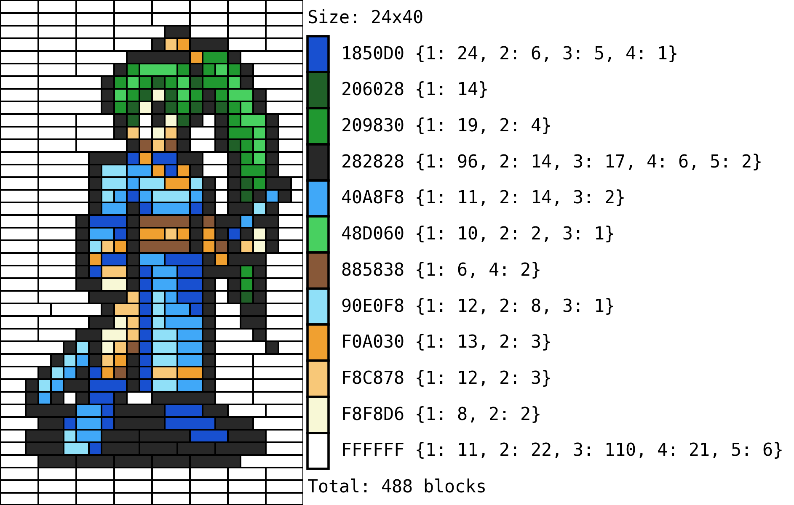
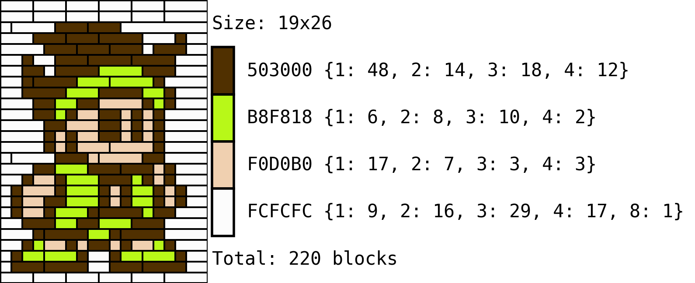
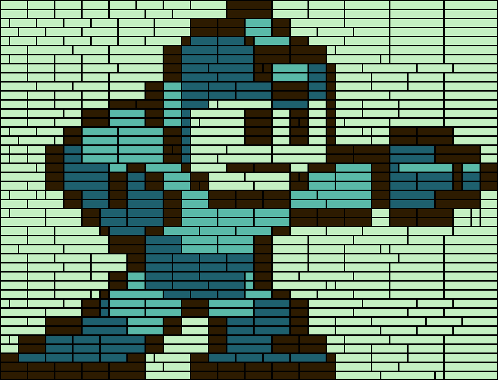
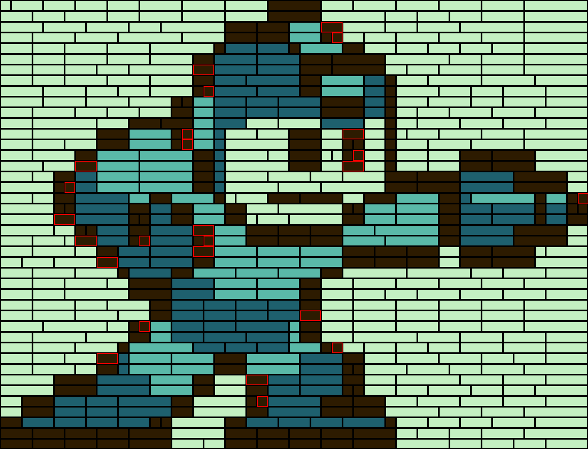
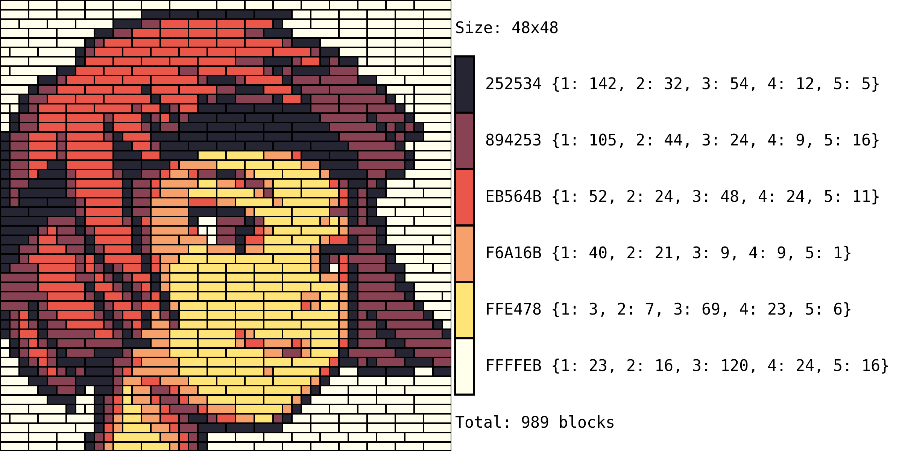
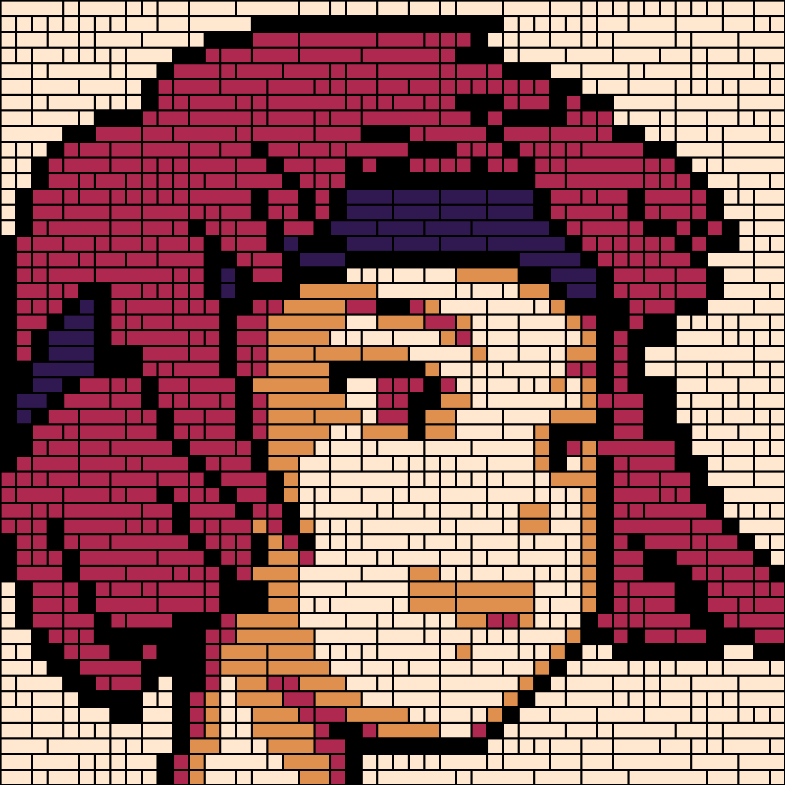
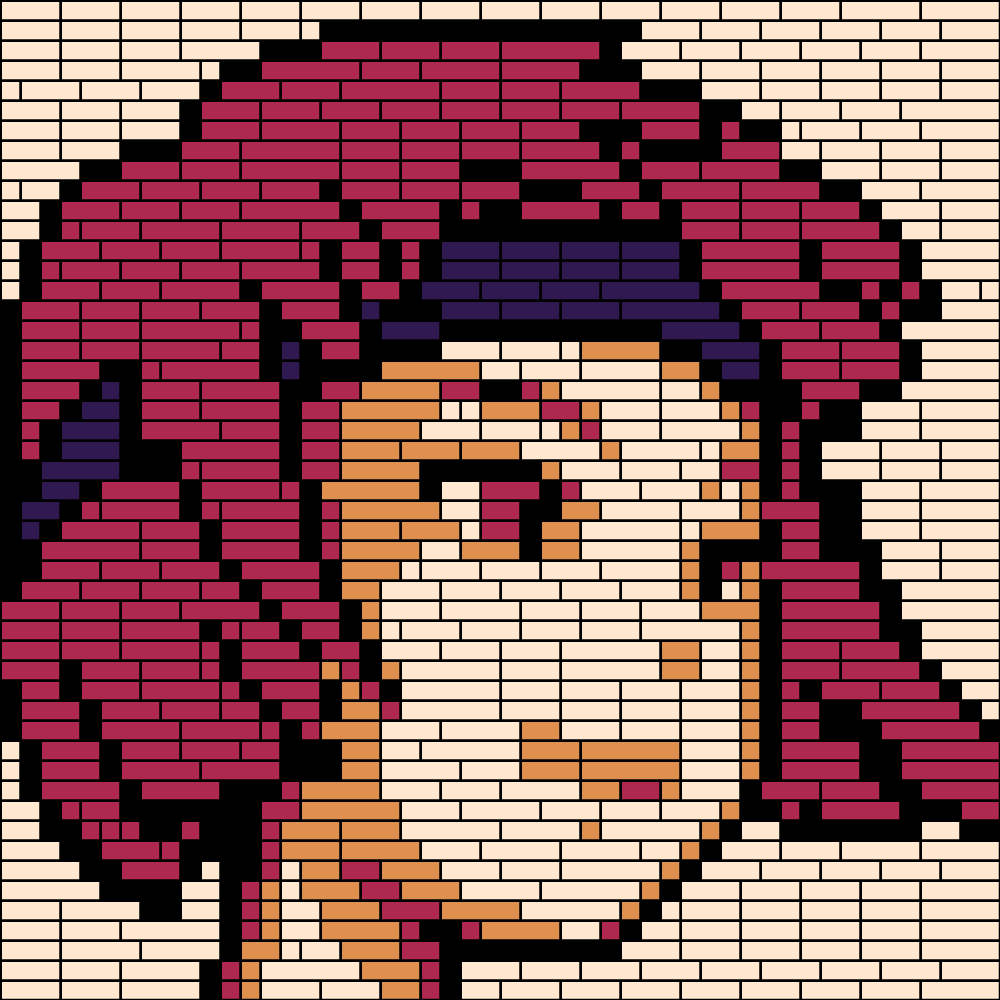
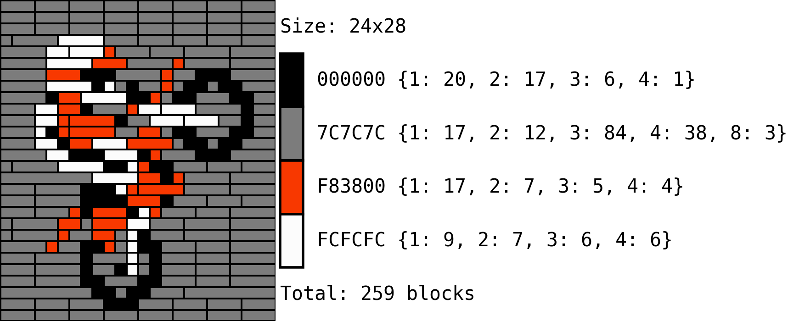

<br>

**Still being written! Sorry for the stubs and errors!**

<!--more-->


In this companion post to the original [Lego Portrait Optimizer](./2022-04-04-LegoOptimizer.html), we will go a bit more into details on how the pipeline works for specific examples and a minor extension that was added to deal with cases which might be too large for the optimization to run in feasible computing times.

<center></center>

# Settings File

I haven't had any time to create a routine that takes in user inputs and settings in a neat way, so as of the time of writing the parameters for the algorithm are setup in the [settings.py](https://github.com/Chipdelmal/LegoOptimizer/blob/main/settings.py) file. An example of this follows:

```python
USER_SEL = {
    'size': (50, 50),
    'palette':  pal.PEAR_36['palette'],
    'blocks': cst.LIMITLESS_BLOCKS_SUPPLY,
    'priority': cst.LARGE_FIRST_BLOCK_VALUES,
    'verbose': True,
    'scaler': 30,
    'lengthMax': 500,
    'shuffler': 'length',
    'shuffleRange': (-5, 5)
}
```

Where the parameters mean:

* **size:** Output image's size in `(width, height)`.
* **palette:** Color palette with list of available hex values, or number of desired colors if auto-clustered (set to `255` for no color reduction). Additionally, this entry can take a dictionary with blocks availably by color (providing this overrides the **blocks** setup entry).
* **blocks:** Pool of available blocks for the optimizer (see the [block availability section](#block-availability) for more information).
* **priority:** Block preference dictionary (see the [block preference section](#block-preference) of the blogpost).
* **verbose:** If set to `True`, provides feedback on the progress of the algorithm (highly recommended).
* **scaler:** Upscale factor for the final image (relative to the original).
* **lengthMax:** Maximum allowed color length before it is split into chunks for optimization purposes (see the [tracktable optimization](#tracktable-optimization) section for more information).
* **shuffler:** Type of [scrambler algorithm](#scrambling) to shorten the color lengths (see its [section](#scrambling) section for more information). Set to `None` if no scrambler is needed (optimization time might be intractable). The two available options are: [`shuffler`](#random-uniform) and [`length`](#vertical-bands).
* **shufflerRange:** If the `length` shuffler is selected, this parameter determines the range of options for the random window on the selection (see the [vertical bands scrambler](#vertical-bands) section for more information).

<center></center>

# Block Preference

In the [original post](/artsci/2022-04-04-LegoOptimizer.html) we briefly mentioned that the algorithm could use "weights" to prioritize the use of block of certain lengths over others. The way this is done through the [Knapsack Problem](https://en.wikipedia.org/wiki/Knapsack_problem#Multiple_knapsack_problem) is by assigning more relative value to the items (blocks) that we would preferred getting used. This way, we are pretty much telling the optimization routine to try its best to use the most valuable blocks whenever possible.

In the codeset, this is setup with dictionaries, where the key is the block length, and the value is the item's relative priority (defined in the [constants.py file](https://github.com/Chipdelmal/LegoOptimizer/blob/main/constants.py)):


```python
NULL_BLOCK_VALUES =         {1:1,  2:1, 3:1,  4:1,  5:0,  6:1,  7:0,  8:1,  9:0,  10:1 }
BALANCED_BLOCK_VALUES =     {1:2,  2:4, 3:8,  4:10, 5:0,  6:5,  7:0,  8:3,  9:0,  10:1 }
SMALL_FIRST_BLOCK_VALUES =  {1:10, 2:9, 3:8,  4:7,  5:0,  6:5,  7:0,  8:3,  9:0,  10:1 }
LARGE_FIRST_BLOCK_VALUES =  {1:1,  2:3, 3:8,  4:10, 5:0,  6:15, 7:0,  8:20, 9:0,  10:25}
```

from which I am importing one and setting it up on the pipeline in the [settings.py](https://github.com/Chipdelmal/LegoOptimizer/blob/main/settings.py) file.

Note: blocks of length 5, 7 and 9 are assigned a priority of 0 by default because these lengths are not easy to get in standard Lego sets. The parameter can be changed if so desired so that these lengths are also used by the optimization algorithm (most of the examples shown in this post include length 5 blocks 'cause the value was updated after these were generated).

# Block Availability

Now, for the algorithm to take into account limited block quantities, we can define a color palette as a dictictionary in the form:

```python
PALETTE_NAME = {
  HEX_COLOR_1 = FLAT_LIST_OF_AVAILABLE_BLOCKS,
  HEX_COLOR_1 = FLAT_LIST_OF_AVAILABLE_BLOCKS,
  ...
  HEX_COLOR_N = FLAT_LIST_OF_AVAILABLE_BLOCKS,
}
```

For example, if we wanted to define a GB-styled palette we would do the following:

```python
GB_BLOCK_SUPPLY = {
    '#2d1b00': [1]*50 + [2]*80 + [3]*90 + [4]*50 + [5]*25 + [6]*10,
    '#1e606e': [1]*25 + [2]*75 + [3]*50 + [4]*50 + [5]*20 + [6]*30,
    '#5ab9a8': [1]*50 + [2]*30 + [3]*10 + [4]*90 + [5]*40 + [6]*10,
    '#c4f0c2': [1]*80 + [2]*80 + [3]*80 + [4]*80 + [5]*90 + [6]*90
}
```

where, for example, the color `#2d1b00` would have 50, 80, 90, 50, 25 and 10 blocks with a length of 1 to 6 respectively. In these situations the algorithm will do its best to find a solution to the image. If the solution is found, all the blocks will be highlighted in black (left); but if some blocks are missing, these entries will be highlighted in red (right) and marked as negative in the bill of materials.

<center> </center>

Please note that if the color palette is provided in this form as a dictionary, the only colors that will  be used will be the ones provided as keys, and the only blocks available to create the image will be the ones in the dictionarie's values (the `blocks` entry in the [setup dictionary](https://github.com/Chipdelmal/LegoOptimizer/blob/main/settings.py) will be ignored).

# Tracktable Optimization

One of the problems with using the algorithm as [originally coded](./2022-04-04-LegoOptimizer.html) is that if the image has a small number of colors but large dimensions, the color encodings become quite long, hence causing the number of possible combinations for optimization to explode in number. Now, the easiest way to go about it without having to change our pipeline is to split the colors which have a long run-length into smaller pieces.

Fortunately, due to the way we decided to map the colors into indices when processing the image allows us to map the same color to multiple indices, which will be quite useful so that we can treat each one of the mapped indices independently and then reconstruct the image back together without having to modify the optimization algorithm. We will call this process "scrambling" and there's two currently implemented approaches.


<center></center>


## Scrambling

Both functions start by determining which colors are way to long in their encoding and segmenting these into parts in different ways.

Just as a warning, these current approaches only work when run on constant pools of blocks, as an extension for the assignment of blocks to the additional indexes is yet to be implemented in the codebase.

### Random Uniform

The simplest way to implement this scrambling idea is to take each row of pixels and, replacing the selected entries by the extended dictionary... For example, if one of the rows looked like this:

```
1 1 1 1 0 1 0 1 0 1 1 1 1 0 0 1 0
```

and we were dividing it approximately in half, we would want it to be "replaced" with either a `0` or a new index `2`, so we could randomly sample between these options each time we find a `0`:

```
original:  1 1 1 1 0 1 0 1 0 1 1 1 1 0 0 1 0
scrambled: 1 1 1 1 2 1 0 1 0 1 1 1 1 0 2 1 0
```

Repeating this process across the whole image would result in a somewhat balanced distribution of `0`s and `2`s; which we can now feed to the optimizer after re-running the run-length encoding and adding our new color encodings in our mapping dictionaries.


### Vertical Bands

The random uniform case has the downside of fragmenting the image too much, which results in a lot of small blocks getting used instead of long ones. One way to fix this is to divide the image into vertical bands in each row and replacing values within these bands.

Let's take for example the following two rows of our image and assume we were trying to reduce the number of `0` in about half.

```
1 1 1 1 0 1 0 1 0 0 0 1 1 0 0 1 0
0 0 0 1 0 1 0 0 1 0 1 0 1 1 1 1 0
```

What we could do would be to split both rows by the middle and map the second part's `0`s to `2`s. 

```
1 1 1 1 0 1 0 1 | 2 2 1 1 1 2 2 1 2
0 0 0 1 0 1 0 0 | 1 2 1 2 1 1 1 1 2
```

This would, however, result in our final image running a visible line of blocks where the image is split. A better way to do this is to divide our image into two parts but instead of just doing it by the middle, sampling an offset (positive or negative for each row, so that the splitting "seam" is a bit more hidden.


```
1 1 1 1 0 1 | 2 1 2 2 1 1 1 2 2 1 2
0 0 0 1 0 1 0 0 1 0 | 1 2 1 1 1 1 2
```

This process is repeated in each row before re-running the run-length encoding and extending the mapping dictionaries.


## Notes and Caveats

Given these two approaches, we can compare their results with the left image being the naive "random uniform" (`shuffler` in the code) and the "vertical bands" (`length` in the code) on the right:

<center> </center>

The naive approach quite obviously framgents the figure way too much, which whould make the figure both more expensive, and difficult to build. The bands approach is more balanced and provides a more natural result in the replacement.

Now, the less obvious downside to these approaches is that the algorithm might not find a solution to the positioning of blocks even if the blocks pool is sufficient. This might happen in a narrow range of situations because the algorithm will find a solution for the first index to which the color was mapped, then remove the blocks that were used, and then optimize the second index. Scenarios in which pieces that were used in the first process might be needed in the second step, with some replacements being still available in the end. This is, however, an unlikely case and can be remedied by trying different samplings of splits, or split lengths.

# Final Thoughts


<center></center>

# Code Repo

* **Repository (coming soon):** [Github repo](https://github.com/Chipdelmal/LegoOptimizer)
* **Dependencies:** [opencv-python](https://pypi.org/project/opencv-python/), [Pillow](https://pillow.readthedocs.io/en/stable/), [numpy](https://numpy.org/), [OR-Tools](https://developers.google.com/optimization/install), [compress-pickle](https://pypi.org/project/compress-pickle/), [termcolor](https://pypi.org/project/termcolor2/)