 

<!--more-->

# Intro

Bought an [Elegoo Saturn 8K](https://www.elegoo.com/products/elegoo-saturn-8k-msla-10inch-monochrome-lcd-resin-3d-printer) resin printer a couple of months ago and I'd been playing around printing things available on the [thingiverse](https://www.thingiverse.com/) when I started thinking of doing something simple to bring back some of the CAD skills I acquired a long while back while working at [Volvo Buses México](https://www.volvobuses.com/mx/). After some time I figured I could do something with the [Mario Kart 8 Cups Logos](https://www.nintendo.com/sg/switch/aabp/course/index.html) and that's how this adventure began.

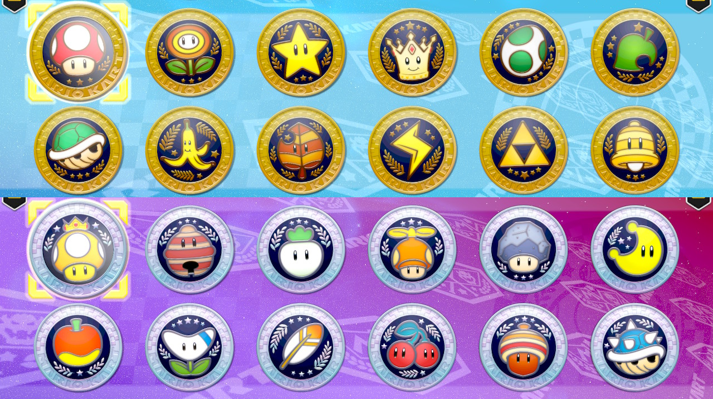

# Modelling and Printing

It had been a while since I last did some CAD modelling so I had to get back up to speed with the basics of solids design, along with the specifics of learning the 3D printing process, with this in mind I decided to create a set of tokens or coins with the logos so that we could end up with a display of the whole collection.

## Getting the SVG Files

First thing was to find all the emblems in a vector format, so that I could use it in CAD software. This proved a bit difficult as some of the not-yet-released cups were missing online. After some searching, I came across [LittleMisCrafter's etsy shop](https://www.etsy.com/listing/1312670032/mario-kart-grand-prix-24-cup-emblems-pgn?click_key=a54109d9687e8f3c48fd1fdbc961d5cc46e19d14%3A1312670032&click_sum=7bf57879&external=1&rec_type=ss&ref=landingpage_similar_listing_top-1&pro=1&sts=1) which was selling the SVG files at a good price (around 10 USD), so I bought them there (seller also included color and monochorme PNGs, so I highly recommend her shop).

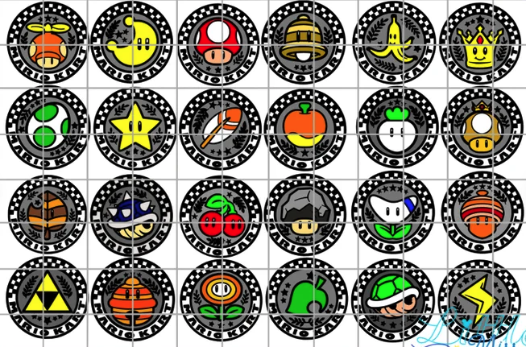

With these in hand, it was time to figure out how to go about the 3D modelling process.

## CAD Modelling

Throughout undergrad and my time at [Volvo](https://www.volvobuses.com/mx/) I learnt and used [Dassault Systemes: CATIA](https://www.3ds.com/products-services/catia/), so I initially gravitated towards using it. After installing it through [VirtualBox](https://www.virtualbox.org/) and jumping through some hoops I got my initial drafts modelled in it by [importing DXF files](https://www.youtube.com/watch?v=3IfOtq2tLwY&ab_channel=CatiaV5-V6Tutorials) to the draft editor, and successfully exported the [STL files](https://www.youtube.com/watch?v=Ia9tG8q-6Xk&ab_channel=CatiaV5-V6Tutorials) for use with the [Chitubox slicer](https://www.chitubox.com/en/index).

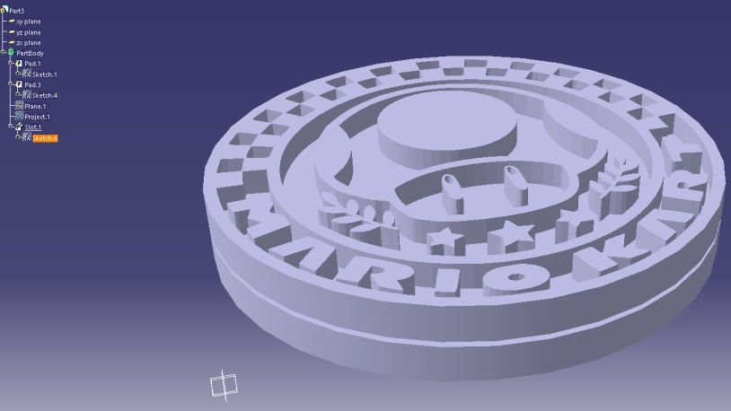

This, however, was a somewhat convoluted and time-consuming process which took a long time in order to get the 24 tokens print-ready. While watching some Youtube videos I came across the online [onshape](https://www.onshape.com/en/) CAD development suite. I'm not a huge fan of web-based applications but I work on both MacOS and Linux, so gave it a try and was pleasantly surprised. It took me some time to get used to the interface and differences to [CATIA](https://www.3ds.com/products-services/catia/) but the whole workflow was quite streamlined, aside from some slight awkwardness in the controls here and there.  

With the new software at hand I came back to re-do all the tokens in amore streamlined way. The way I went about it was to create a blank token object with a groove (to create a support for the coins), then [import the logo tracing (as DXF)](https://cad.onshape.com/help/Content/insertdwgordxf.htm?Highlight=Dxf) and carve the "logo" shape into the solid object.

  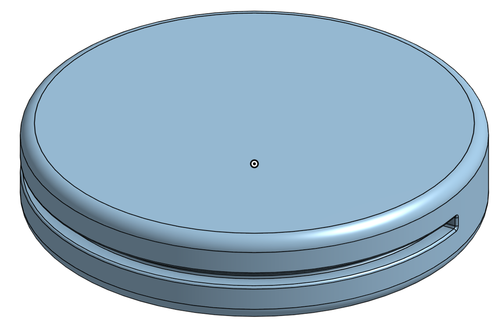
  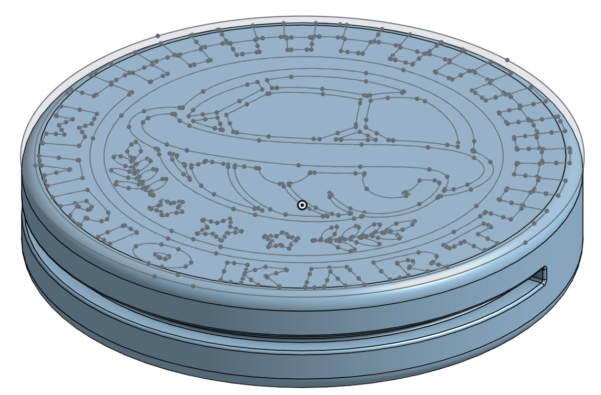
  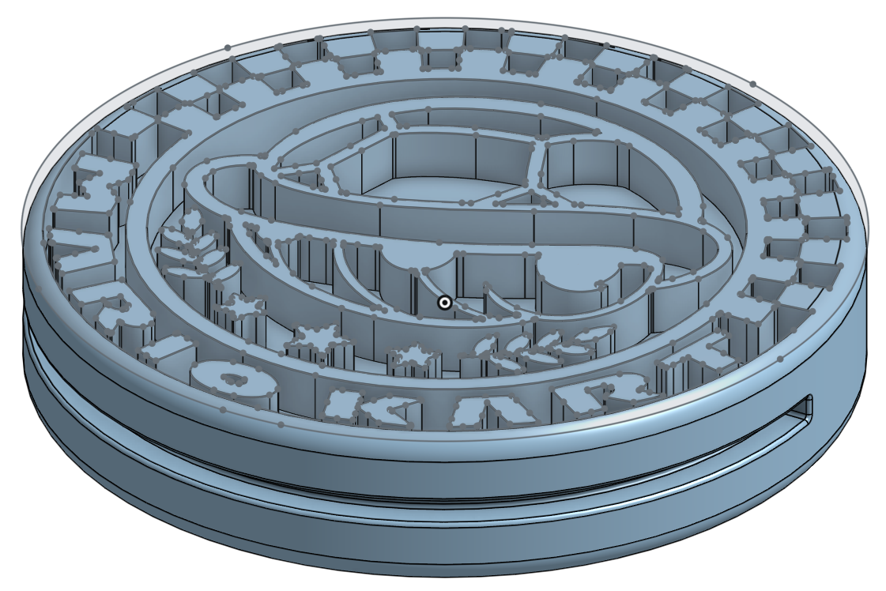
  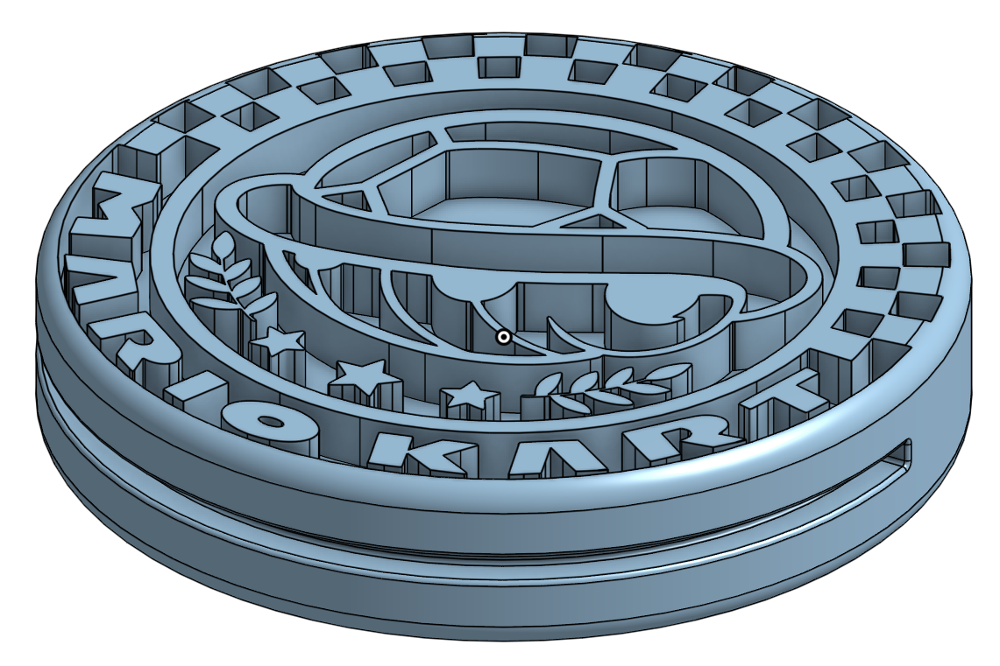

This whole process took a couple of hours but was finally able to get all the 3D models done and [exported to STL files](https://cad.onshape.com/help/Content/exporting-files.htm) for the next step of this project.

  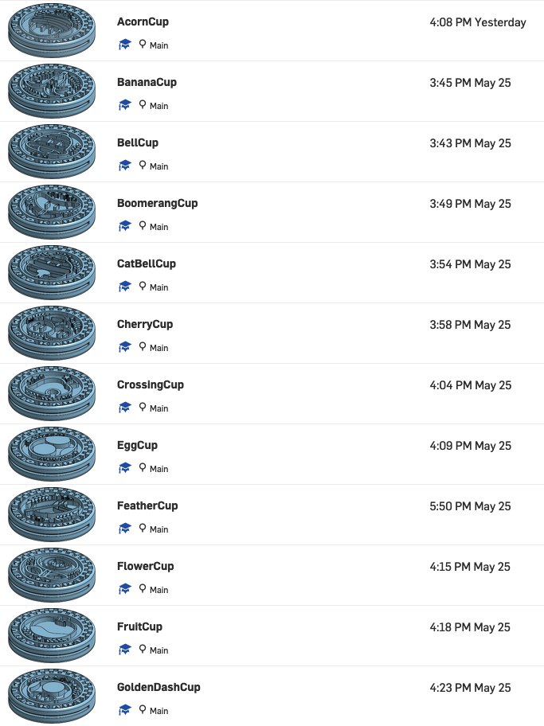
  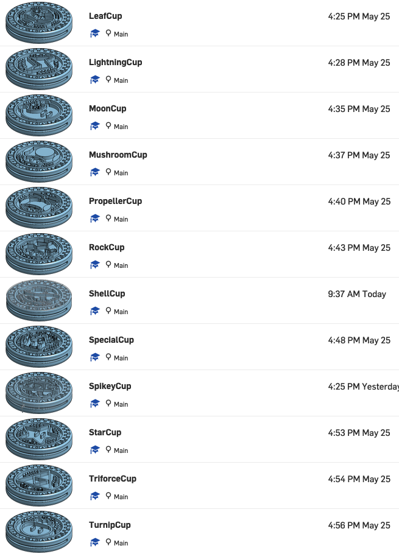

## 3D Printing

Took a bit of testing and experimenting with the exposure, rafts, supports, and step to get the right level of resolution on the prints. In the end I ended up gravitating to the following parameters for the print:

* Step: 0.075
* Exposure: 2.625
* Bottom Exposure: 30
* Approximate Room Temperature: 25C
* Resin: [Elegoo Standard Grey Resin](https://www.elegoo.com/products/elegoo-standard-resin)

After some initial tests, I decided not to use rafts as it gave me better results that needed less sanding and postprocessing (removing the rafts was a time-consuming process involving a lot of sanding with the Dremel).

  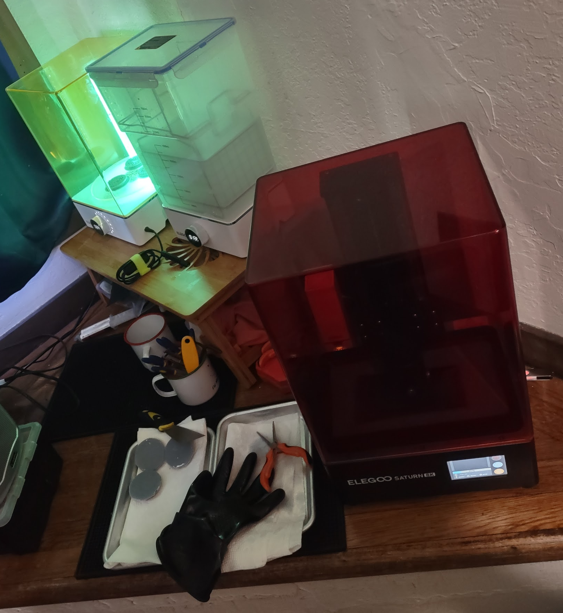
  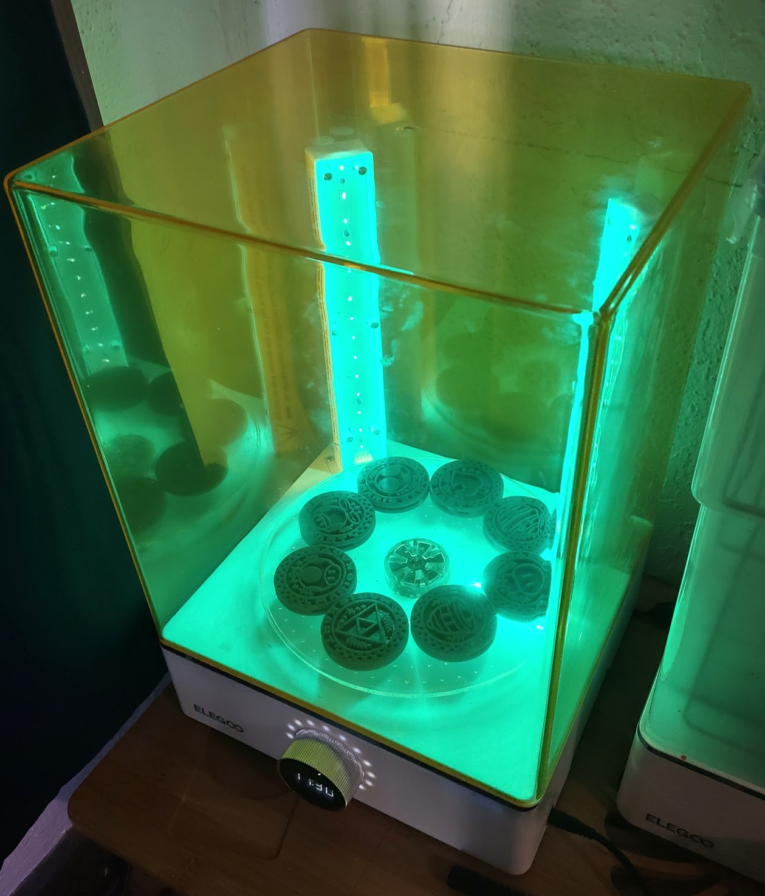

## Postprocessing

The prints came out relatively close to ready, but they did need some sanding on the bottom and some pressure-relieving holes drilled into them so that they wouldn't "explode" due to temperature/pressure changes.

  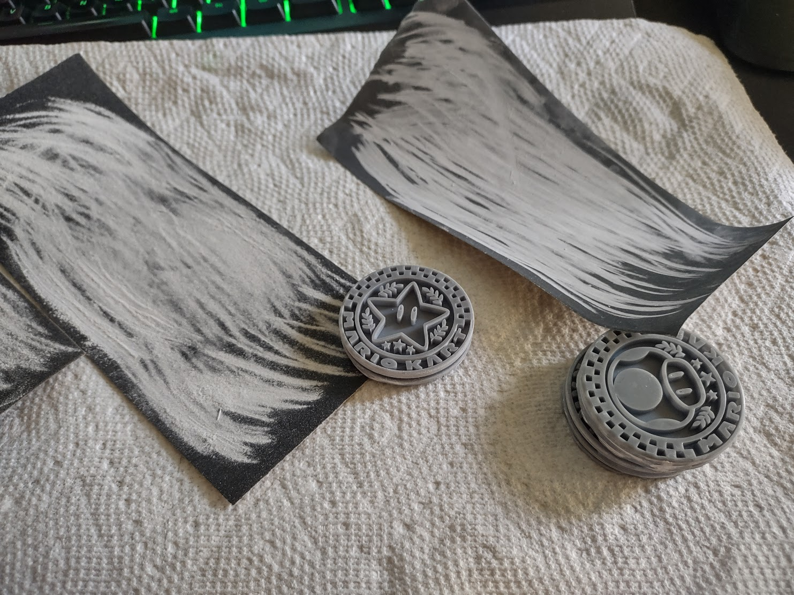
  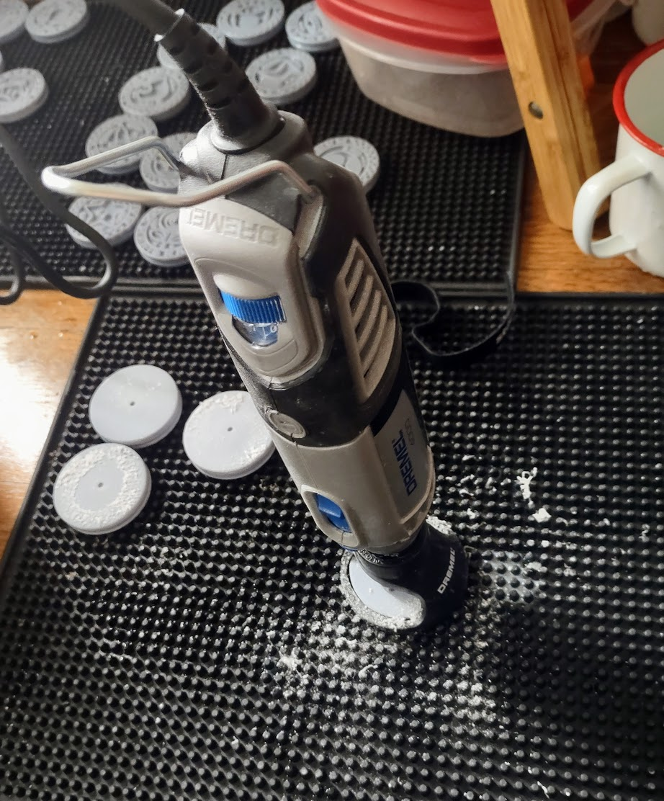

  

# Final Thoughts

This has been a pretty fun project so far. It's still missing the final touches with paint and finish but I'll update the post with those in the near future!

  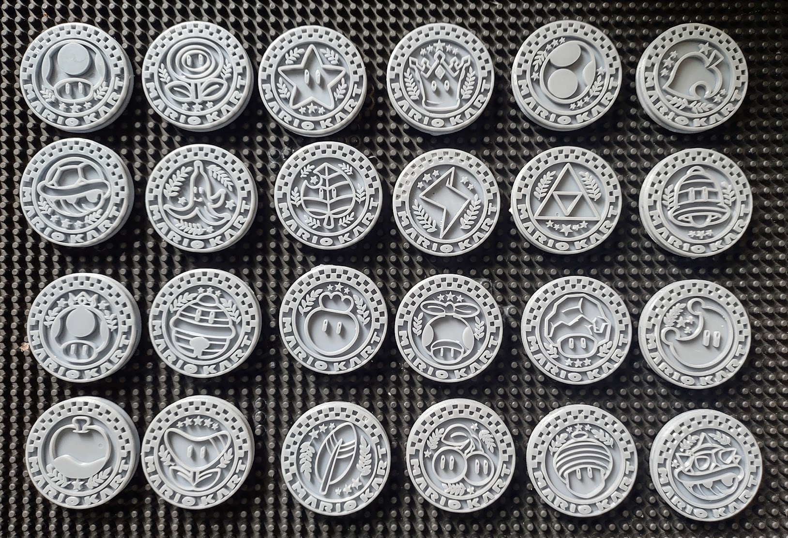

# Models

* STL Files: [Thingiverse](https://www.thingiverse.com/thing:6092716)