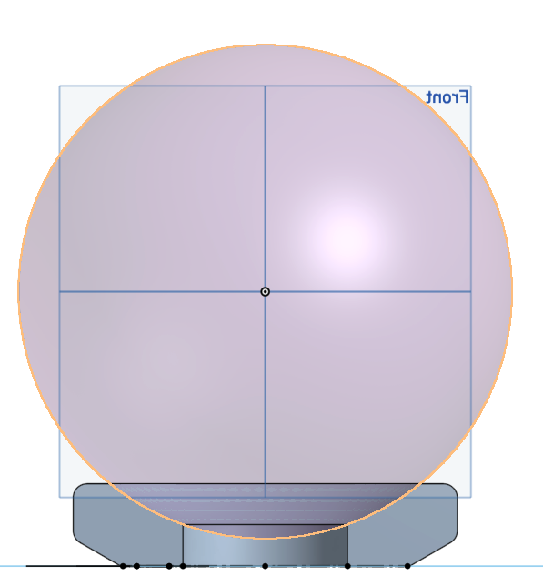

 

After a trip to ["Star Wars: Galaxy's Edge"](https://disneyland.disney.go.com/destinations/disneyland/star-wars-galaxys-edge/) I ended coming back with a BB-Series robot and needed to find a way to showcase it in my room, so I modeled and printed a simple stand for it.

<!--more-->

# Initial Work

Fortunately for this model, the droid's shape is a perfect sphere that can be taken apart in two sections, so I took the diameter of the body of the robot, which was about 180mm (some rough estimates are also available [here](https://plandisney.disney.go.com/question/range-sizes-finished-droids-droid-depot-know-depends-414815/)). With this at hand, I also took a quick measurement of the printing bed of my [Elegoo Saturn 8K](https://www.elegoo.com/products/elegoo-saturn-8k-msla-10inch-monochrome-lcd-resin-3d-printer) which was about 120mm wide. This was the upper limit for the dimensions of the design.

Initially, I had designed a "large" 4-part support for the droid, but decided to simplify it in favor for a smaller 2-part one for easier manufacturing. Additionally, I came up with an "interlocking" mechanism to make the assembly of the different parts easier, but this ended up being just a partial success for reasons I will explain in the latter section of this post.

# Design

There's several ways to go about modeling this stand and I probably didn't follow the most efficient one, as I was adding details here and there as I went through it, but here's the general process I followed.

## Base Support

To get the general shape of the base, I modeled the spherical-shape of the droid, and used it's profile to trim a rectangular shape that was revolved 180° around the sphere's axis. After doing this, and couple of fillets & chamfers, we end up with this:

## Locking Tabs

Now, glueing resin parts together has been difficult for me in the past, as the drying time tends to be a bit long so I wanted to make it easier to keep segments together and in place during this process. I added a couple of "tabs" one positive and one mirrored negative on each side of the support as follows:

As I mentioned earlier, I had initially added a couple of "pegs" to further lock the two sections together but this ended up not working very well after printing, as locking them involved some rotations and stresses that could potentially break the tabs appart, so I dropped this idea in the revision to the 3D model.

## Edge Styling

I added some simple styling around the base. This was a simple negative revolve with chamfers & fillets:

## Legs

The support would've probably worked just fine as it was, but I wanted to add some legs to it just to make it look more appealing and to make it more stable. This was relatively easy by creating a rectangular shape and doing a rotational transformation around the central axis:

After chamfers and fillets, the result was the following:

# Print & Postprocessing

Moving on to the manufacturing process, there's several parts of this endeavour that I'd improve for future iterations (specially on the slicing end of the pipeline).

## Slicer

In the slicing part of the process, I did add a skate raft to the model but didn't want to add a gap between the model and the plate (which was a mistake as it added a lot more work in the post-print phase).

Additionally, some drains were added to avoid any problems with trapped resin:

## Printing

I set the bottom exposure time to 35s to make sure the model adhered well to the base plate (although, I should've sticked to 30s, as getting the parts unstuck from the plate was somewhat difficult); and ran the print with a 3s exposure time for each layer:

The printing process took around 2h for each one of the two prints.

## Postprocessing

This was the most laborious end of the process. Initially, I had to remove all the raft's pieces from the bottom part of the prints (which could've been avoided if I had lifted the model from the plate in the slicing phase):

After doing this, I pasted both prints with some contact-glue and filled the small gaps between them with some epoxy:

## Result and Notes

The end result was good for an initial run. I still want to do some painting and maybe another print to get a better-looking stand, but for now I'm happy with this!

Some things that I need to do for the next iteration are:

* Add spacing between the model and the plate to improve the quality of the bottom section of the print.
* Reduce the base exposure time to make it easier to remove the model from the base plate.
* Check the layer exposure times to make sure the tolerances are followed for better fits between the parts.

# Models

* STL Files: [Thingiverse](https://www.thingiverse.com/thing:6248214)
