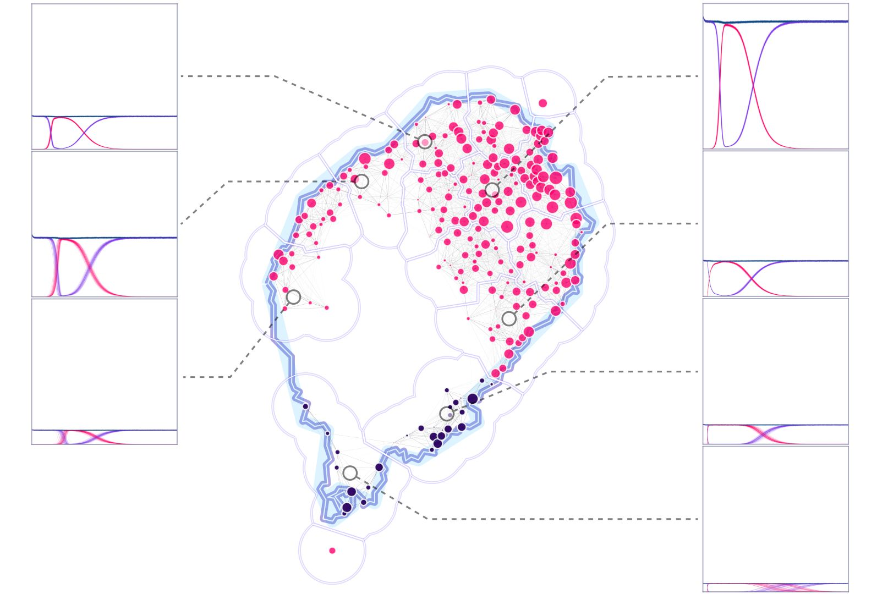
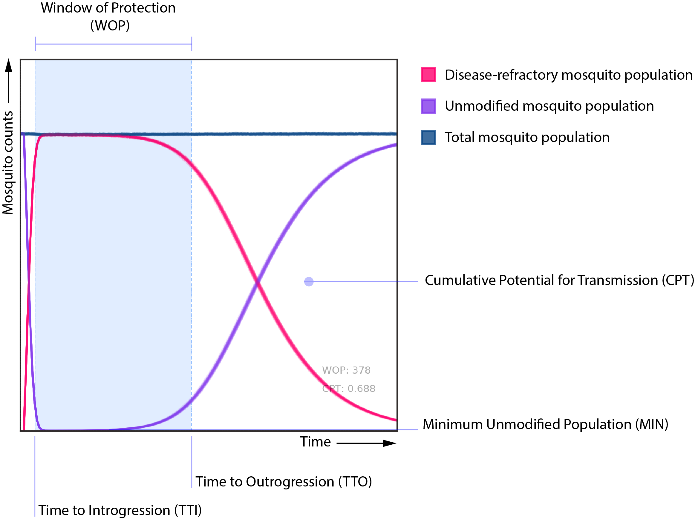

 

Using marginal-effect traces to understand the response of a system to different inputs.

<!--more-->

# Intro

Some time ago, I was working on figuring out the best way to interpret a random forest model we were putting together in analyzing the potential releases of GM mosquitos in the [islands of São Tomé and Príncipe](https://youtu.be/oMgY5RXQCRc). The general idea was to create a random forest surrogate model out of the factorial datasets generated by [MGDrivE](../research/2017-07-01-MGDrivE.html) so that we could analyze the genetic construct's properties that could lead to elimination of malaria in the region, and the sensitivity to changes in these parameters on the expected outcome.

While working in this project, I came across the ["Interpretable Machine Learning" (Christoph Molnar)](https://christophm.github.io/interpretable-ml-book/) book, which had several useful tips and tricks to make ML models easier to interpret and trust. A couple of the tools that struck me as particularly useful were the [Partial Dependence Plots (PDP)](https://christophm.github.io/interpretable-ml-book/pdp.html) and [Individual Conditional Expectation (ICE)](https://christophm.github.io/interpretable-ml-book/ice.html) visualizations; so we coded a variation of them so that we could use them in our analyses.

# Description

In this dataset, we're analyzing the effects of ten different gene drive design components (sex of releases, releases number, size of releases, fitness cost on homing allele, fitness cost on in-frame resistance, fitness cost on out-of-frame resistance, homing rate on males and females, resistance generation and genetic standing variation). To do this, we ran factorial experiments over a range of values of interest for each one of the variables. 

## Metrics and Variables

We are interested in how changes in these input parameters affect metrics such as the "window of protection (WOP)" and the "cumulative potential for transmission (CPT)". In a general sense, these two metrics gauge how long the potentially disease-transmitting mosquito population is kept below a certain threshold (WOP), and how much this population is reduced from the no-intervention baseline case (CPT).

We are also analyzing the effect of these parameters upon other metrics, such as the time to introgression (TTI) and outrogression (TTO), and probability of elimination (POE); but these are of secondary interest to the analysis compared to the former two.

## Premise

The idea behind the variation of these [PDP](https://christophm.github.io/interpretable-ml-book/pdp.html) and [ICE](https://christophm.github.io/interpretable-ml-book/ice.html) plots was to use the same "one-at-a-time" approach in visualizing the effects of the independent variables upon the summary statistics, but to use the raw output dataset as generated from [MGDrivE](../research/2017-07-01-MGDrivE.html) instead of the evaluation of a machine learning model. In principle, the idea is fairly simple. For each variable/statistic combination we:

1. Hold the value of every other independent variable constant (except for the one we're interested in)
2. Get the simulated values of the independent variable of interest, and their corresponding values upon the statistic of interest
3. Plot the resulting "trace" in an XY coordinate system

And that's it. We repeat the process for each and every entry of the factorial experiment and play around with the traces' opacities and widths so that the resulting plot is easier to interpret.

## Plots and Interpretation

As an example, I'll show some of our preliminary results on our simulated dataset. In the following panel, we can observe that the variables that have the strongest correlation to the WOP and CPT, are the fitness costs. The homing allele's fitness cost is particularly important, because as this value increases, the WOP gets drastically smaller and the CPT increases (both of which mean that there's more potential for disease transmission).

Number of releases (REN) and releases size (RES) are fairly straightforward to read and interpret: the more releases, and the larger they are, the better reduction in disease transmission (and their effects are fairly linear). In-frame (FCR) and out-of-frame (FCB) resistant alleles' fitness costs need a bit more interpretation, though. In both these cases we have traces that show some correlation to the output variable (trending downwards for CPT and upwards for WOP), and some traces that show no effect upon it (staying fairly horizontal for both). To make sense of this behavior we do need to know a bit about the underlying process that generated the dataset. In this case, what matters most is the relation between the three fitness costs, particularly the homing allele's versus both the in-frame and out-of-frame ones. If the fitness cost of the homing allele is low enough (close to zero), the cost of the other two alleles is somewhat irrelevant as individuals with those alleles won't get any fitness advantage over the former ones, hence the effect of changes in their values will not impact the disease protection (and the trace line will remain flat).

# Wrapping Up

These plots are a good tool to understand the general trends and impacts of different variables upon a desired set of metrics. With a brief glance, and some understanding of the underlying processes at play, we can make some quick assessments of complex relationships between processes. These plots, however, show only one-to-one relationships. In the case of more complex interactions between independent variables and outcomes, these traces should be used for exploration of general trends and patterns, more than to draw specific conclusions about the behavior of systems.

# Code Repo

* Repository: [Github Repo](https://github.com/Chipdelmal/MoNeT_DA/blob/main/STP/RBC/STP_dtaDICE.py)