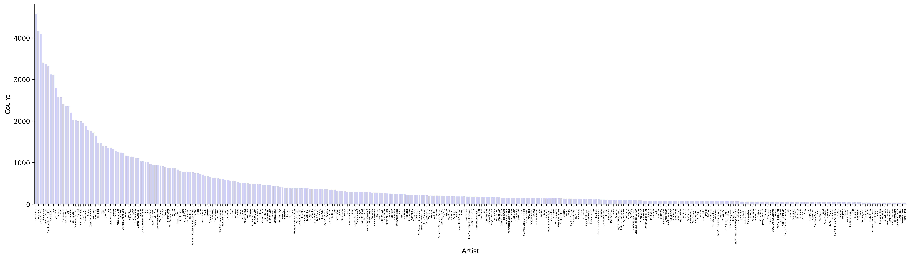

<br>

**Coming soon!**

<!--more-->

# Intro


# Code Description

## [Dataset & Cleaning](https://github.com/Chipdelmal/LastfmViz/blob/master/cleanDataframe.py)

We will be working with an updated version of the dataset described in a [previous post](/artsci/2019-12-10-LastfmViz.html). A small sample of the data looks as follows:

```
Artist              Album               Song                    Datetime

John Moreland       In The Throes       Your Spell              2022-06-17 21:02:00-07:00
Eels                Shootenanny!        Rock Hard Times         2022-06-17 20:58:00-07:00
Page France         Come I'm a lion!    Bridge                  2022-06-17 20:44:00-07:00
The Lumineers       Cleopatra           Gale Song               2022-06-17 20:40:00-07:00
John Moreland       High on Tulsa Heat  Losing Sleep Tonight    2022-06-17 20:35:00-07:00
...
Fort Atlantic       Fort Atlantic       My Love Is With You     2022-06-17 20:12:00-07:00
Fort Atlantic       Fort Atlantic       There Is Love           2022-06-17 20:08:00-07:00
Caamp               Lavender Days       Lavender Girl           2022-06-17 20:05:00-07:00
Houndmouth          Good For You        McKenzie                2022-06-17 20:02:00-07:00
```

The full initial dataset contains more than $175,000$ entries before data cleaning and represents the music I've listened to on my personal devices over the period dating from 2012 up to mid 2022. NNow, there's a slight caveat with my original that and it is that all the data prior to 2012 was registered and transfered from a previous username I had to a new one. This caused the data from before 2012 extremely messy, with dates assigned to 1970; hence, we will only be using the data from my current username.

To clean our dataset there's another couple of things we need to take into account. The first one is that there are "artists" that are not really artists (such as podcasts, or videos), which were sometimes scrobbled to my [last.fm](https://www.last.fm/) account. To filter out these cases, we use a "ban list" that gets passed to our script and eliminates all the artist matches. It's also worth noting that I am focusing on my English-speaking music, so all Spanish-speaking bands were added to the ban list for now.

Now, there are some error sources in the data. One of them is different naming of the same artist (for example, "The Smashing Pumpkins" and "Smashing Pumpkins"). In the case of my dataset it was easy enough to clean by hand by providing a mapping dictionary, although it could have also been fixed with the [musicbrainz](https://musicbrainz.org/) data that I've used in other applications.

Finally, there are situations in which it seems that I left some playlists on repeat, which artificially inflated the count of some artists. To fix this, I defined a daily interval and deleted the day information of artists that were played by an amount that seemed unlikely to happen in a normal situation. I decided to use an upper bound of 100 plays in one day, which would mean that I'd have to listen to that artist for around 5h in the interval (assuming each song is around 3 minutes long), which seems high enough to be somewhat realistic (given that I work constantly listening to music); but also a good point to say "ok, maybe I just left my device on repeat". It's worth noting that there are better ways to determine this (as detecting the pattern of songs), but for our analysis the threshold is good for now.

After all the data cleaning we still have around $165,000$ entries to work with in this analysis.

## The Network

The most important part of this analysis is the transitions network. Initially, I was just calculating transitions between artists as: _"if I listen to artist $a$ followed by artist $b$, it should count as a transition"_. The first thing I noticed, though, was that this would also count transitions that ocurred over timespans that would be too large. For example, if I listened to artist $a$, then went away and started listening to artist $z$ 8 hours later, it should probably be assumed that there was no correlation between me listening to artist $a$ and then wanting to listen to artist $z$ after such a long period of time. To avoid this, I defined a timedelta between transitions for them to be valid, so from this point on, all the transitions that will be discussed asume that if the play-events happen in a timespan longer than the defined timedelta, they are discarded.

The second thing that I noticed was that the requirement for contiguous plays for them to count as transitions is too strict. For example, if I listen to the following artist sequence: $a,b,c,b,a,b,c$ ; only counting immediate plays as transitions, artists $a$ and $c$ would never be correlated even though they probably should (given that they appear often in an [n-gram](https://en.wikipedia.org/wiki/N-gram) fashion). To alleviate this in a simple way, I decided to define a weighted sum in which the distance between the artists defines how much that transition contributes to the network. In a more formal way, I defined the transitions between two artists $a$ and $b$ over a window sized $s$ that starts at entry $t$ in the database as follows:

$$T(t:s)_{a\rightarrow b}=\frac{a_{t}\rightarrow b_{t+1}}{1}+\frac{a_{t}\rightarrow b_{t+2}}{2}+\frac{a_{t}\rightarrow b_{t+3}}{3}+...+\frac{a_{t}\rightarrow b_{t+s}}{s}=\sum_{w=1}^{s}\frac{a_{t}\rightarrow b_{t+w}}{w}$$

where $(t:s)$ is the sliding window for the weighted transitions. This process is repeated for all the artist pairs to calculate our weighted matrix $\tau^s$. It is worth noting, however, that the code fills this matrix in a different way by calculating the independent artist-to-artist matrices in sliding windows of size $s$ and then doing their weighted average accordingly.

$$\tau^s=\frac{T(t,t+1)}{1}+\frac{T(t,t+2)}{2}+\frac{T(t,t+3)}{3}+...+\frac{T(t,t+s)}{s}$$

where $(t,t+n)$ represents strict transitions of distance $n$ (the dataset is traversed a total of $n$ times, which might be inefficient, but is good enough for testing). This generalizes to:

$$\tau^s=\sum_{s=1}^{w}\sum_{t=1}^{l}\frac{T(t,t+s)}{s}$$

for all the play-entries on the dataset ($l$) across all artists. Additionally, we calculate the probability matrix by normalizing the matrix row-wise (where the rows are indexed by $i$, and $c$ is the number of artists, or columns):

$$\beta^s=\sum_{i=1}^{c}\frac{\tau^s_{i}}{c}$$

And, finally, as we are interested in the transitions between artists, we set the diagonal of our matrix $\tau^s$ to zero (no self transitions).


## [Frequency Rank](https://github.com/Chipdelmal/LastfmViz/blob/master/transitions.py)

A nice way to visualize transitions data is through a [chord diagram](https://en.wikipedia.org/wiki/Chord_diagram_(information_visualization)). In this representation, the categories are depicted in a circular axis and the connections between them are represented by arcs that connect them with their relative frequency mapped to its width. In our paticular application, the artists are mapped to the circular axis and the transitions between them are shown as the arcs.

The first thing on the process is to reduce the number of artists to be displayed, as plotting the $650+$  entries is not interpretable at all. In an initial attempt to determine a quantitative threshold I plotted the artists frequencies to see if there was a point in which the trend made a "jump" or was discontinuous, so that we could use that as the break-point; but the distribution of frequencies showed no such jump. 



Moreover, this playcount frequency showed a [Zipf's-like](https://en.wikipedia.org/wiki/Zipf%27s_law) shape, which is a bit more apparent when using a $log$ scale on the $y$-axis:


After testing this idea out, I decided to use an initial arbitrary threshold of the top $100$ artists for the chord plot. Now, for the window size described in the [network](#the-network) description I used a value of $5$, which seems to provide a good balance of correlation information between artists (more on this will be described in the [SBM section](#nested-sbm) of this document).

## [Chord Diagram](https://github.com/Chipdelmal/LastfmViz/blob/master/transitions.py)


# Future Work

One obvious optimization point is to calculate the windowed matrix in a more efficient manner. Traversing the array multiple times is quite inefficient. Additionally, the results could be stored for future use.

Interval filtering (stats-driven)... 

Musicbrainz integration...

# Code Repo

* Repository: [Github Repo](https://github.com/Chipdelmal/LastfmViz)
* Dependencies: [graph-tool](https://graph-tool.skewed.de/), [mpl_chord_diagram](https://codeberg.org/tfardet/mpl_chord_diagram), [matplotlib](https://matplotlib.org/), [pandas](https://pandas.pydata.org/), [numpy](https://numpy.org/)