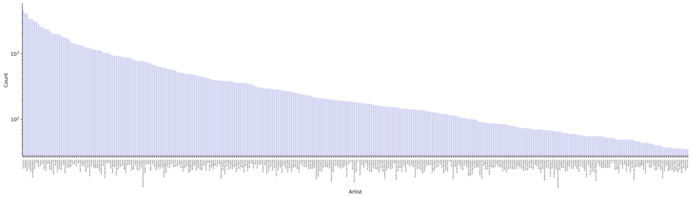

 

**Coming soon!**

<!--more-->

# Intro

# Code Description

## [Data Cleaning](https://github.com/Chipdelmal/LastfmViz/blob/master/cleanDataframe.py)

## The Network

The most important part of this analysis is the transitions network. Initially, I was just calculating transitions between artists as: _"if I listen to artist $a$ followed by artist $b$, it should count as a transition"_. The first thing I noticed, though, was that this would also count transitions that ocurred over timespans that would be too large. For example, if I listened to artist $a$, then went away and started listening to artist $z$ 8 hours later, it should probably be assumed that there was no correlation between me listening to artist $a$ and then wanting to listen to artist $z$ after such a long period of time. To avoid this, I defined a timedelta between transitions for them to be valid, so from this point on, all the transitions that will be discussed asume that if the play-events happen in a timespan longer than the defined timedelta, they are discarded.

The second thing that I noticed was that the requirement for contiguous plays for them to count as transitions is too strict. For example, if I listen to the following artist sequence: $a,b,c,b,a,b,c$ ; only counting immediate plays as transitions, artists $a$ and $c$ would never be correlated even though they probably should (given that they appear often in an [n-gram](https://en.wikipedia.org/wiki/N-gram) fashion). To alleviate this in a simple way, I decided to define a weighted sum in which the distance between the artists defines how much that transition contributes to the network. In a more formal way, I defined the transitions between two artists $a$ and $b$ over a window sized $s$ that starts at entry $t$ in the database as follows:

$$T(t:s)_{a\rightarrow b}=\frac{a_{t}\rightarrow b_{t+1}}{1}+\frac{a_{t}\rightarrow b_{t+2}}{2}+\frac{a_{t}\rightarrow b_{t+3}}{3}+...+\frac{a_{t}\rightarrow b_{t+s}}{s}=\sum_{w=1}^{s}\frac{a_{t}\rightarrow b_{t+w}}{w}$$

where $(t:s)$ is the sliding window for the weighted transitions. This process is repeated for all the artist pairs to calculate our weighted matrix $\overline{\overline{\tau^s}}$. It is worth noting, however, that the code fills this matrix in a different way by calculating the independent artist-to-artist matrices in sliding windows of size $s$ and then doing their weighted average accordingly.

$$\overline{\overline{\tau^s}}=\frac{\overline{\overline{T(t,t+1)}}}{1}+\frac{\overline{\overline{T(t,t+2)}}}{2}+\frac{\overline{\overline{T(t,t+3)}}}{3}+...+\frac{\overline{\overline{T(t,t+s)}}}{s}$$

where $(t,t+n)$ represents strict transitions of distance $n$ (the dataset is traversed a total of $n$ times, which might be inefficient, but is good enough for testing). This generalizes to:

$$\overline{\overline{\tau^s}}=\sum_{s=1}^{w}\sum_{t=1}^{l}\frac{\overline{\overline{T(t,t+s)}}}{s}$$

for all the play-entries on the dataset ($l$) across all artists. Additionally, we calculate the probability matrix by normalizing the matrix row-wise (where the rows are indexed by $i$, and $c$ is the number of artists, or columns):

$$\overline{\overline{\beta^s}}=\sum_{i=1}^{c}\frac{\overline{\tau^s_{i}}}{c}$$

And, finally, as we are interested in the transitions between artists, we set the diagonal of our matrix $\overline{\overline{\tau^s}}$ to zero (no self transitions).

## [Chord Diagram](https://github.com/Chipdelmal/LastfmViz/blob/master/transitions.py)

A nice way to visualize transitions data is through a [chord diagram](https://en.wikipedia.org/wiki/Chord_diagram_(information_visualization)). In this representation, the categories are depicted in a circular axis and the connections between them are represented by arcs that connect them with their relative frequency mapped to its width. In our paticular application, the artists are mapped to the circular axis and the transitions between them are shown as the arcs.

The first thing on the process is to reduce the number of artists to be displayed, as plotting the $650+$  entries is not interpretable at all. In an initial attempt to determine a quantitative threshold I plotted the artists frequencies to see if there was a point in which the trend made a "jump" or was discontinuous, so that we could use that as the break-point; but the distribution of frequencies showed no such jump. 

Moreover, this playcount frequency showed a [Zipf's-like](https://en.wikipedia.org/wiki/Zipf%27s_law) shape, which is a bit more apparent when using a $log$ plot on the $y$-axis:

After testing this idea out, I decided to use an initial arbitrary threshold of the top $100$ artists for the chord plot. Now, for the window size described in the [network](#the-network) description I used a value of $5$, which seems to provide a good balance of correlation information between artists (more on this will be described in the [SBM section](#nested-sbm) of this document).

## [Nested SBM](https://github.com/Chipdelmal/LastfmViz/blob/master/network.py)

# Future Work

One obvious optimization point is to calculate the windowed matrix in a more efficient manner. Traversing the array multiple times is quite inefficient. Additionally, the results could be stored for future use.

# Code Repo

* Repository: [Github Repo](https://github.com/Chipdelmal/LastfmViz)
* Dependencies: [graph-tool](https://graph-tool.skewed.de/), [mpl_chord_diagram](https://codeberg.org/tfardet/mpl_chord_diagram), [matplotlib](https://matplotlib.org/), [pandas](https://pandas.pydata.org/), [numpy](https://numpy.org/)