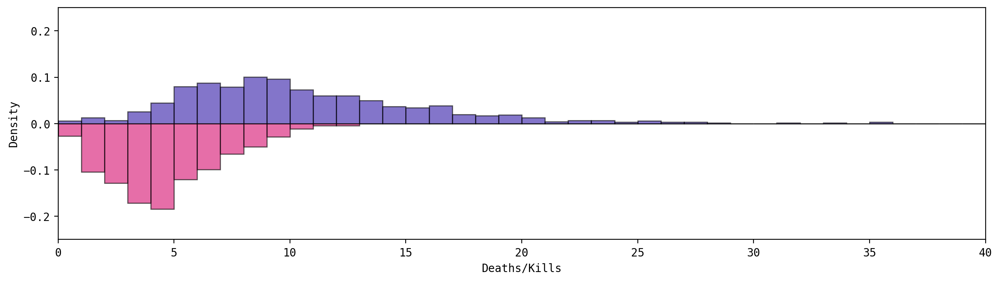
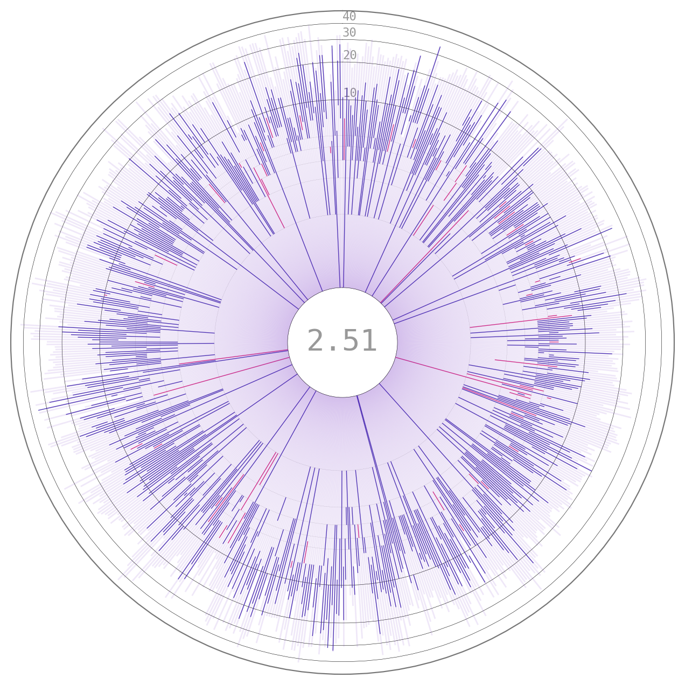
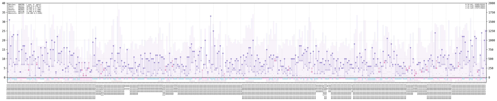

<br>

Creating a python package to analyze "Splatoon 3"'s personal statistics.

<!--more-->

# Intro

With the release of [Splatoon 3](https://en.wikipedia.org/wiki/Splatoon_3), I was excited to get some games down when I found out a team of programmers had created the [s3s](https://github.com/frozenpandaman/s3s) package to download the statistics on your matches and use them on the [stat.ink](https://stat.ink/) website. I tried it out and downloaded my available history (last 50 matches) to [JSON files](https://en.wikipedia.org/wiki/JSON). With these files at hand, I started having a go at using them to perform analyses upon the data.


<center><a href='https://github.com/Chipdelmal/SplatStats'></a></center>

# Data Exploration

The first thing to do was to take a deep dive into the raw JSON files. This was a somewhat hard task, as some of the structures were nested up to 8 levels deep and there was no documentation on them. Fortunately, most of the structures names were fairly intuitive for someone who has played splatoon for a while.


```
{
  vsHistoryDetails
    id
    vsRule
      name, id, rule
    vsMode
      mode, id
    player (a)
      isPlayer, name, nameId, vsStage, festMatch
      paint, judgement (win/lose), knockout, duration, playedTime
      awards
        name, rank
      headGear
        name, primaryGearPower, additionalGearPowers
      clothingGear
        name, primaryGearPower, additionalGearPowers
      shoesGear
        name, primaryGearPower, additionalGearPowers
      myTeam
        result
          paintRatio, score
        players: list of players, all with their own values
          id
          name
          weapon
            name
            specialWeapon
              name
            subweapon
              name
          gear
          result
            kill, death, assist, special
      otherTeams: list of "myTeam" objects containing the info on enemy teams
}
```

From these extremely thorough structures I set off in the adventure of making the most of it without getting lost in the forest of details and keeping the scope of the project somewhat concise. With this in mind, I decided to go for a structure that would allow for the analysis of player statistics like kills, deaths, wins, ko's; over time, stages, match-types, etc; and in a way that would allow for the filtering and reshaping of the data to do more analysis.


# Code Description


Initially, I wanted to parse the JSON files directly into the players' objects, but then I realized that this would generate duplicate data, as it might be the case that multiple players you want to analyze are part of the same battle. This is exactly my use-case, as I play with my friends and would like to analyze the whole data from the battles we all play together. To have a middle-ground between the huge JSON files and the player objects the first step was to define a battle class so that all the data could be serialized to unique files.


## Battle Class

As this is the lowest-level class, it has to hold the most amount of raw information so that wrapper classes are able to do flexible analyses. After looking for a while at the JSON structures, I decided I wanted the following data from each battle for each player involved:

```
'main weapon', 'sub weapon', 'special weapon', 
'kill', 'death', 'assist', 'special', 'paint', 
'head name', 'head main', 'head sub_0', 'head sub_1', 'head sub_2', 
'shirt name', 'shirt main', 'shirt sub_0', 'shirt sub_1', 'shirt sub_2', 
'shoes name', 'shoes main', 'shoes sub_0', 'shoes sub_1', 'shoes sub_2', 
'win', 'score', 'datetime', 'ko', 'stage',
'match type', 'duration', 'splatfest', 
'award_0', 'award_1', 'award_2'
```

More categories can be added later on if necessary, but it's a good first step towards getting some interesting information processed. To store these data from the JSONs, it is processed and stored in dataframes within the class separated by "allies" and "enemies", where the teams are relative to the player who "owns" the battle data (the one whose credentials were used to download the files). A somewhat annoying side-note is that for the tri-turf battles to be possible, the enemy teams are stored in a list of dataframes, unlike the allies one which is just a dataframe, but this is taken into account in all the methods of the class.

Finally, a couple of notes: 

* Some of these data are common for all the players, such as: `datetime, ko, stage, matchType, duration, festMatch`, so these are attributes of the class itself and only added to the dataframes when the data is requested by one of the member functions.
* Battles are stored with UTC±00:00 timezone as they can contain the information of several users across different timezones (the timezone parameter is part of the player class).
* Awards information is only stored for the "owner" of the JSON file (as this information is not available on the other participants).


## Player Class

This class is the one that does most of the interesting things in terms of data analysis. A player is instantiated with its in-game name and the path to the battle files from which the information will be extracted (user id support will be added in the future). Once this is set, the class automatically parses the player's history into a dataframe, which takes a for such as the following:


This is one of the main structures that is used in the analyses, as it contains a ton of information about the player's performance in all the matches, so it can be used to do some quick visualizations and trends analyses. The class also auto-separates dataframes by battle type, to make quick processing of specific data easier; along with general statistics for the player both in aggregate, and by battle type (such as total/average/per minute: kills, deaths, assists, paint).


Finally, the class also contains a battles records attribute, in which all the battles of which the player has been part of (as owner, ally, or enemy) are stored in case some different processing is needed.


# Use Example

But enough code-structure talk, let's go through a demo (for people interested in more details of the program, please have a look at the [documentation](https://chipdelmal.github.io/SplatStats/) for further details and examples).


I've been storing and tracking my data through the past month or so. Whenever I finish a 2h session I simply run the following command on the [s3s scripts](https://github.com/frozenpandaman/s3s) folder:

```bash
python s3s.py -o
```

This downloads my most current JSON battle data (up to 50 battles) into that folder (`~/Documents/GitHub/s3s/` in this example). The [s3s codebase](https://github.com/frozenpandaman/s3s) automatically generates a different folder each time I download the data, so I can safely just run the script each time I finish a gaming session and it just stores it in the same base directory with a new nested folder so that all the historic data is preserved (it doesn't matter if there are duplicated or overlapping battles data, as that's handled by [SplatStats](https://chipdelmal.github.io/SplatStats/)).


Now, let's jump into python to import our packages and setup our input path (where the JSON data folders are stored), and the output one (where we will be exporting the battle data files):

```python
from os import path
import matplotlib.pyplot as plt
import SplatStats as splat

(iPath, oPath) = (
    path.expanduser('~/Documents/GitHub/s3s/'),
    path.expanduser('~/Documents/Sync/BattlesData/')
)
```

Now, the following lines parse the JSON files paths, extract the battle objects from them, and return the paths of the serialized battle object files:


```python
hPaths = splat.getDataFilepaths(iPath)
bPaths = splat.dumpBattlesFromJSONS(hPaths, oPath)
```

Ok, enough parsing files, let's create our player! In my case, I know my player name but in case you're not sure, or if it has strange characters just run:

```python
battles = splat.loadBattlesFromFiles(bPaths)
splat.getPlayerCountsInBattles(battles)
```

and your username should probably on top of the list.

With this in place, let's instantiate my player, and extract the battle history:

```python
name = 'čħîþ ウナギ'
plyr = splat.Player(name, bPaths, timezone='America/Los_Angeles')
pHistory = plyr.battlesHistory
```

And we're all set to do some cool analysis! Let's say I was interested in the "Turf War" matches I played with my Splattershot and killed more than 15 enemies whilst dying less than 5 times. We can do this easily with some standard dataframe filtering:

```python
filters = (
    pHist['main weapon'] == 'Splattershot',
    pHist['match type'] == 'Turf War',
    pHist['kill'] >= 15,
    pHist['death'] <= 5,
)
fullFilter = [all(i) for i in zip(*filters)]
pHist[fullFilter]
```

Moreover, we could further filter this result to have a peek at other things such as the gear I was using at that point:

```python
pHist[fullFilter][['kill', 'head main', 'shirt main', 'shoes main']]
```

Now, let's do some plotting! There are some dedicated functions to do basic analysis. One of this is the frequency distributions of kills and deaths during matches, which can be plotted as follows:

```python
(fig, ax) = plt.subplots(figsize=(15, 5))
(fig, ax) = splat.plotKillsAndDeathsHistogram(
    (fig, ax), pHist, (0, 40), yRange=(-.25, .25), 
    normalized=True
)
ax.set_ylabel('Death/Kill\nFraction')
ax.set_xlabel('Frequency')
plt.savefig(
    path.join(oPath, f'Histogram - {plyr.name}.png'), 
    dpi=200, bbox_inches='tight', facecolor=fig.get_facecolor()
)
```

<center></center>


This graph shows us how many kills we get on average in a match (top) against the number of times we die in it (bottom). In my specific case it can be seen that, on average, I tend to get more kills than deaths in any given match with some extreme outliers around the 35 kills mark; whilst the mode of the times I die during a match hangs around the 4 region.

Now, we can also analyze several stats broken down by match type and stage:

```python
(matchType, metric) = ("Turf War", "paint avg")
if matchType != "All":
    stagesStatsMatch = splat.calcStagesStatsByType(pHist)[matchType]
else:
    stagesDF = splat.calcStagesStats(pHist)
(fig, ax) = plt.subplots(figsize=(5, 5))
(fig, ax) = splat.plotTreemapByStages(
    (fig, ax), stagesDF, metric=metric, 
    fmt='{:.2f}', pad=0.1, alpha=.6
)
```

<center>
  
  
</center>

Which can be pretty useful when breaking down on which stages we perform the best. In my case I tend to lose a lot in "Scorch Gorge" during Rainmaker matches, which I can totally understand as I struggle badly in that stage.

These stats can be any of the following (and others can easily be extended) for any of the match-types (including the aggregate of all):

```
'total matches', 'paint', 'win', 'loss', 'win ratio', 'kill ratio',  'kassists ratio', 'kills', 'deaths', 
'assists', 'special', 'kassists', 'kills avg', 'deaths avg', 'assists avg', 'special avg', 'paint avg', 
'kassists avg', 'kills prm', 'deaths prm', 'assists prm', 'special prm',  'paint prm', 'kassists prm'
```

Other aggregations such as weapon-type are possible. Have a look at the [docs](https://chipdelmal.github.io/SplatStats/build/html/plots.html) for more examples!


Finally, for my two favorites: the iris plot and the matches history one. These two show the kill to death ratio as a bar (or line) which is blue if the player got more kills than deaths, and magenta otherwise. Rectangles on the back represent the painted surface. In the iris plot matches are temporally distributed clock-wise and the kills/deaths are radially shown with a symlog scale by default:


```python
(fig, ax) = plt.subplots(figsize=(8, 8), subplot_kw={"projection": "polar"})
(fig, ax) = splat.plotkillDeathIris(
    (fig, ax), pHist,
    innerGuides=(0, 6, 1), outerGuides=(10, 50, 10),
    frameColor="#000000AA"
)
```

<center></center>

The number at the center is the result of the following calculation: $$(kills * 0.5 assists)/deaths$$; which in my dataset is around 2.5, which makes sense as I usually play under the "slayer" style.

The matches history plot contains even more information, with the match-type, weapon used, if it was a KO, splatfest, win or loss; all in the same display! Have a look at the [full explanation](https://chipdelmal.github.io/SplatStats/build/html/plots.html#matches-history-panel) for more details!

```python
fig = plt.figure(figsize=(30, 5))
gs = fig.add_gridspec(
    2, 1,  width_ratios=(1, ), height_ratios=(.75, .05),
    left=0.1, right=0.9, bottom=0.1, top=0.9, wspace=0.05, hspace=0
)
(ax_top, ax_bottom) = (fig.add_subplot(gs[0]), fig.add_subplot(gs[1], sharex=ax_top))
(_, ax_top) = splat.plotMatchHistory(
    (fig, ax_top), pHist, ilocRange=xRange,
    yRange=yRange, sizeMultiplier=1
)
(_, ax_bottom) = splat.plotMatchTypeHistory(
    (fig, ax_bottom), pHist, ilocRange=xRange,
    sizeMultiplier=.9, labelsize=5.5
)
```

<center></center>


That's it for this example. I'll be updating the framework and extending its capabilities but for now have a look at the [full code](https://github.com/Chipdelmal/SplatStats/blob/main/SplatStats/demos/blogDemo.py) used to create this demo!

# Future Work

The next feature I've been working on is the "Team" class with which I will try to make the analysis of groups of people more straightforward. Once that is done I plan on improving the aesthetics of my plots and looking into integrating parts of the [s3s](https://github.com/frozenpandaman/s3s) data-scraping capabilities into pipelines that automate the data download to make the whole process more automated. Finally, I want to work a bit more on features like breaking down the team compositions that get the most wins/losses to analyze and improve my gameplay.

# Code Repo

* Repository: [Github Repo](https://github.com/Chipdelmal/SplatStats)
* Dependencies: [matplotlib](https://matplotlib.org/), [pandas](https://pandas.pydata.org/), [numpy](https://numpy.org/), [dill](https://pypi.org/project/dill/), [termcolor](https://pypi.org/project/termcolor/), [colorutils](https://pypi.org/project/colorutils/), [tqdm](https://pypi.org/project/tqdm/), [scipy](https://pypi.org/project/scipy/), [DateTimeRange](https://pypi.org/project/DateTimeRange/), [pywaffle](https://pypi.org/project/pywaffle/), [squarify](https://pypi.org/project/squarify/)