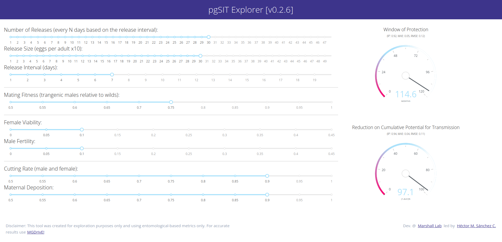
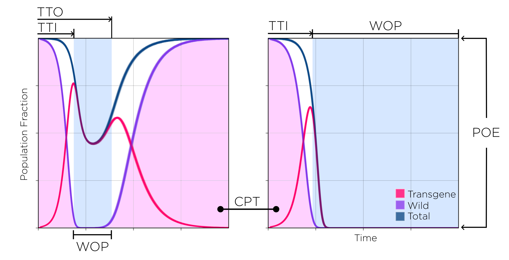
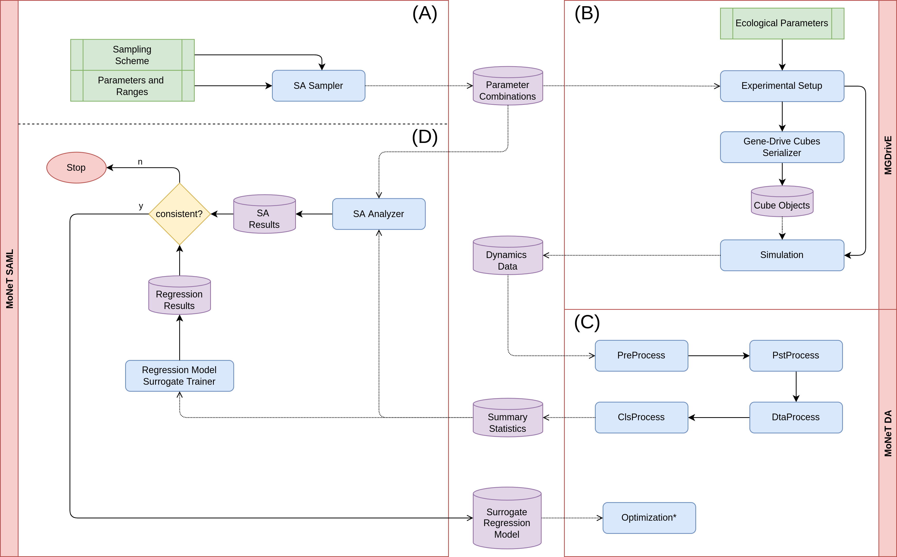
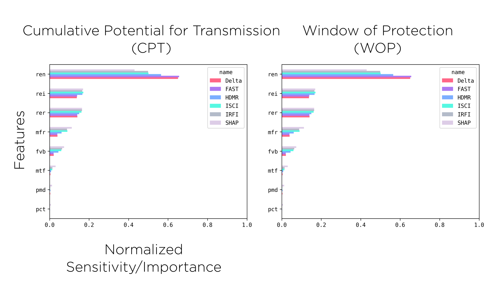
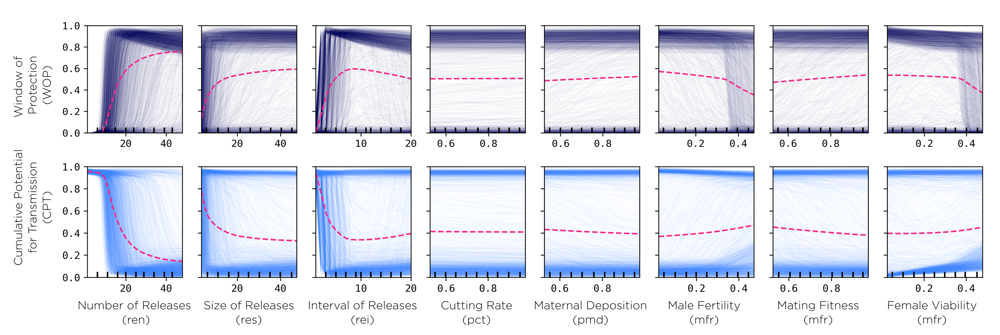

 

GC-SAML (Genetic Construct Sensitity Analysis & Machine Learning) aims towards understanding the complex interactions between different characteristics of genetic constructs through the use of [MGDrivE](./research/2017-07-01-MGDrivE.html) simulations analyzed through the [MoNeT](./research/2018-01-15-MoNeT.html) pipelines.

 

<!--more-->

# General Idea

I've been interested in building surrogate models on our simulated datasets for some time so that they can be examined and shared amongst our collaborators and the community. [MoNeT_ML](https://github.com/Chipdelmal/MoNeT_ML), mainly developed by undergraduate students, was born out of these initial ideas (we even developed an initial set of [online dashboards](https://mgdrive.herokuapp.com/)); but it was still a bit difficult for us to trust the generalizability of the results. [Jared Bennett](https://www.linkedin.com/in/jared-bennett-21a7a9a0?challengeId=AQG1YcdjS7MuHQAAAYQxVUOhuST-mRS2K979qes4AKbDX1aSH6ZyQuHYN1aJMI2wUQZvazP8EQmRyWpCG4fd1F1GZdJqlvNJQQ&submissionId=4f7e1e35-c359-2317-5998-6caa9733d65b&challengeSource=AgEmjt19Zea6-wAAAYQxVXkPYS6ifOzQzVNkFDPCLGOFwKNMkiTN8nQfkFm35fA&challegeType=AgGJjFVMALE59AAAAYQxVXkRCqQezEyzW5Chw30bmtNmB49IUw0lNJY&memberId=AgFjhz0LmaatVQAAAYQxVXkUlmRCGxezPyLns4nNPYb_4Bg&recognizeDevice=AgE2N01-QQUv4gAAAYQxVXkX8hYnStoMNX7T_LSTnYlWZgCKc8Vi) had previously mentioned the existance of the [SALib](https://salib.readthedocs.io/en/latest/) package and how we should do some more rigorous statistical analysis on the data to understand the main factors that determine the performance of genetic constructs. After some time the idea of doing the statistical sensitivity analysis, and fitting a regression model independently to contrast the results against each other as means of validation. Out of this idea, GC-SAML combines both analyses to make a more robust assessment of the surrogate models generated and how different input variables contribute to the genetic interventions' outcomes.

# Workflow

The use of machine learning models as emulators, surrogate models, or for optimization is something that has been gaining traction in the gene drive modeling community ([Champer 2021](https://journals.plos.org/ploscompbiol/article?id=10.1371/journal.pcbi.1009660), [Reiker 2021](https://journals.plos.org/ploscompbiol/article?id=10.1371/journal.pcbi.1009660), [Prowse 2019](https://www.ncbi.nlm.nih.gov/pmc/articles/PMC6398975/)). The methodology we used, however, differs slightly from the ones seen so far as it does not use the regression model for the sensitivity analysis or for optimization; rather, it uses the model as means to validate and cross-check the statistical sensitivity on the original model.

## Metrics (Summary Statistics)

Our data-processing pipelines (developed through our [MoNeT project](https://github.com/Chipdelmal/MoNeT_DA)) are capable of handling different summary statistics to evaluate the performance of genetic  constructs, namely:

* **Window of protection (WOP):** amount of time the non-transgenic population is kept below a given population fraction threshold.
* **Cumulative potential for transmission (CPT):** area under the curve of the non-transgenic population divided by the total simulated time (a value of 1 represents the "no treatment" case whereas a value of 0 means the intervention was completely effective from the time it took place to the end of the simulation).
* **Time to introgression (TTI):** time it takes for the construct to either replace the wild population or bring it below a certain population fraction threshold.
* **Time to outrogression (TTO):** time it takes for the wild population to bounce back above a certain population fraction threshold.
* **Probability of Elimination (POE):** the probability to eliminate the non-transgenic population with the construct (either by replacing it with transgenic mosquitoes, or by crashing the population).
* **Minimum unmodified achieved (MIN):** lowest non-transgenic mosquito population fraction achieved.
* **Time to minimum (MNX):** time at which the lowest non-transgenic mosquito population fraction is achieved.

Most of which we have used in previous publications. It is to be noted that some metrics like the WOP, TTI and TTO depend on a population threshold (THS), which is the relative fraction of the population at which metrics are considered as "active". For example, a THS value of 0.1 (used in this report) considers time on the WOP as any days in which the total population of non-transgenic mosquitoes is kept at or below 0.1 in relation to a baseline "untreated" simulated population (a simulation in which no transgenic releases take place).

## Data Flow

The analysis presented in this document is divided in four phases: generating the sampling scheme to be simulated, running the population dynamics simulations, condensing the output into our summary statistics, and doing the sensitivity analysis on the output.

**(A) Sampling Scheme** In this initial stage, we determine the ranges on which we want to test the parameters. This involves some prior knowledge on how the genetic construct affects the mosquito population, the ranges of parameters we expect it to operate on, and some insight on the computational resources available to run our system. Once we decide upon which ranges we want the information to be gathered, we export the samples to disk as dataframes in CSV format (where each row represents a parameter combination).

**(B) Population Dynamics Simulations** This is the most time-consuming part of the analysis. In this stage, we take the CSV files from the previous step, and run them through [MGDrivE v1](https://marshalllab.github.io/MGDrivE/). The simulation outputs all the system's population dynamics stochastic repetitions into separate folders for each of the parameter combinations. These files contain the mosquito counts broken down by genotype composition across time, which is why we need to process these signals into more manageable summary statistics, so that the sensitivity analysis and regression algorithms can process the data in reasonable timespans.

**(C) Condensing Output** During this stage, we take the genetic history information and transform it into the values we want to do the sensitivity analysis and regression on. This is done in around seven main steps which we will not detail in this document but, in summary, it is here where we convert all the data and re-shape it into CSV files which contain information in the form: $features \rightarrow labels$; where the features are the parameter combinations (including releases schemes), and the labels are our metrics.

**(D) Sensitivity Analysis** In this final process, we take the summary CSV files generated in the previous stage to do the statistical sensitivity analysis, train a machine-learning regression model, and contrast their outputs to validate their results. We do this by taking the first-order interactions of the statistical models and the permutation feature importance of the random forest model (along with the SHAP values). Once these values are validated, and once we have verified the result metrics such as the $R^{2}$ and the mean/median errors, we can use our regression to make some predictions on the behavior of the system on combinations of features.

## Sensitivity Analysis Comparisons

One of our goals with these analyses is to rank the importance of the parameters so that the design of both the genetic constructs and releases schemes. With this in mind, and as a final validation step for our surrogate model, we compare the results from the sensitivity analysis metrics and the feature importance calculated on the machine learning regressors.

## Machine-Learning Regression

We have been trying a variety of methods to do the regression, including [Gradient Boosting Trees](https://scikit-learn.org/stable/modules/generated/sklearn.ensemble.GradientBoostingClassifier.html), [Ada Boost](https://scikit-learn.org/stable/modules/generated/sklearn.ensemble.AdaBoostClassifier.html), and [Histogram-based Gradient Boosting Regressor Trees](https://scikit-learn.org/stable/modules/generated/sklearn.ensemble.HistGradientBoostingClassifier.html); but the ones we found have provided a reasonable fit for our purposes are [Random Forests](https://scikit-learn.org/stable/modules/generated/sklearn.ensemble.RandomForestRegressor.html) and [Mulit-Layered Perceptrons](https://scikit-learn.org/stable/modules/generated/sklearn.neural_network.MLPRegressor.html).

# Working Demo

We have been testing these ideas in an updated versin of the pgSIT construct which we have [modelled in the past](https://www.nature.com/articles/s41467-021-25421-w) collaborating on [Akbari lab's projects](http://www.akbarilab.com/) so keep an eye out for that publication! In the meantine, follow [this link](https://hub.docker.com/repository/docker/chipdelmal/monet-pgs/general) for instructions on how to run our model!

# Code Repos

* **pypi package:** [MoNeT_MGDrivE](https://pypi.org/project/MoNeT-MGDrivE/)
* **Docker Image:** [monet-cef](https://hub.docker.com/repository/docker/chipdelmal/monet-cef)
* **Analysis Repos:** [Data Analysis](https://github.com/Chipdelmal/MoNeT_DA), [Machine Learning](https://github.com/Chipdelmal/MoNeT_ML)